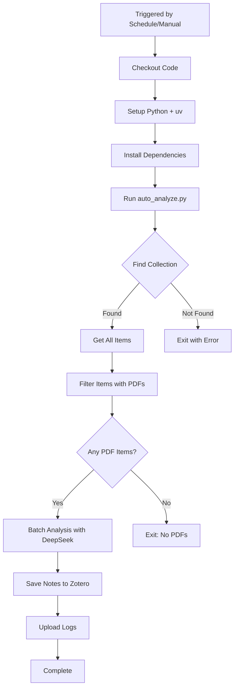

# GitHub Actions Automated Analysis Setup Guide

This guide explains how to set up automated Zotero collection analysis using GitHub Actions.

## 📋 Overview

The automated workflow will:
- Run twice daily at **6:00 AM** and **8:00 PM** Beijing Time (UTC+8)
- Analyze items in the collection **"1 - 中转过滤：较短期"**
- **Only process items that have PDF attachments**
- Skip items that already have analysis notes
- Use **DeepSeek AI** for analysis
- Save results as notes in your Zotero library

## 🔧 Setup Instructions

### Step 1: Configure GitHub Secrets

You need to add three secrets to your GitHub repository:

1. **Navigate to Repository Settings**:
   - Go to your repository on GitHub
   - Click `Settings` → `Secrets and variables` → `Actions`
   - Click `New repository secret`

2. **Add the following secrets**:

| Secret Name | Description | Where to Find |
|-------------|-------------|---------------|
| `ZOTERO_LIBRARY_ID` | Your Zotero User ID | [zotero.org/settings/keys](https://www.zotero.org/settings/keys) (shown as "Your userID for use in API calls is XXXXXX") |
| `ZOTERO_API_KEY` | Zotero API Key | [zotero.org/settings/keys](https://www.zotero.org/settings/keys) → "Create new private key" with **Write access** |
| `DEEPSEEK_API_KEY` | DeepSeek API Key | [platform.deepseek.com](https://platform.deepseek.com) |

**Important**: The Zotero API key MUST have **write permissions** to create notes.

### Step 2: Create GitHub Environment (Optional but Recommended)

For additional security, create a "production" environment:

1. Go to `Settings` → `Environments`
2. Click `New environment`
3. Name it: `production`
4. Add protection rules (optional):
   - Required reviewers (if you want manual approval before running)
   - Deployment branches (restrict to main/master)

### Step 3: Verify the Workflow Files

Ensure these files exist in your repository:

```
.github/
└── workflows/
    └── auto-analyze.yml          # GitHub Actions workflow
src/scripts/

└── auto_analyze.py               # Analysis script
```

### Step 4: Enable GitHub Actions

1. Go to `Settings` → `Actions` → `General`
2. Under "Actions permissions", select:
   - ✅ "Allow all actions and reusable workflows"
3. Under "Workflow permissions", select:
   - ✅ "Read and write permissions"
4. Click `Save`

## 🚀 Usage

### Automatic Execution

The workflow runs automatically on schedule:
- **6:00 AM Beijing Time** (22:00 UTC previous day)
- **8:00 PM Beijing Time** (12:00 UTC)

### Manual Execution

To run the workflow manually:

1. Go to `Actions` tab
2. Select **"Automated Zotero Analysis"**
3. Click `Run workflow`
4. Click the green `Run workflow` button

### Monitoring

**Check Workflow Status**:
- Go to `Actions` tab
- Click on the latest run to see logs

**View Analysis Logs**:
- Each run uploads logs as artifacts
- Available for 30 days after the run

## 📊 What the Workflow Does



## ⚙️ Configuration Options

### Modify Collection Name

Edit `src/scripts/auto_analyze.py`:


```python
COLLECTION_NAME = "1 - 中转过滤：较短期"  # Change this
```

### Disable PDF Filtering

To analyze ALL items (including those without PDFs):

```python
SKIP_NO_PDF = False  # Set to False
```

### Change Schedule

Edit `.github/workflows/auto-analyze.yml`:

```yaml
on:
  schedule:
    # Format: 'minute hour day month day-of-week'
    # All times in UTC
    - cron: '0 22 * * *'  # 6:00 AM Beijing
    - cron: '0 12 * * *'  # 8:00 PM Beijing
```

**Beijing to UTC Conversion**:
- Beijing Time (UTC+8) - 8 hours = UTC
- Example: 9:00 AM CST = 1:00 AM UTC → `'0 1 * * *'`

### Limit Number of Items

Edit `src/scripts/auto_analyze.py`:


```python
MAX_ITEMS = 10  # Process max 10 items per run
```

## 🔍 Troubleshooting

### Workflow Doesn't Run

**Check**:
1. GitHub Actions is enabled in repository settings
2. Secrets are correctly configured
3. The workflow file is in the correct path (`.github/workflows/`)

**Note**: Scheduled workflows may be delayed by 15-45 minutes during peak times.

### "Missing environment variables" Error

**Solution**:
- Verify all three secrets are added:
  - `ZOTERO_LIBRARY_ID`
  - `ZOTERO_API_KEY`
  - `DEEPSEEK_API_KEY`
- Secret names must match exactly (case-sensitive)

### "Collection not found" Error

**Solution**:
- Check the collection name in `src/scripts/auto_analyze.py`

- Collection names are case-sensitive
- Use fuzzy matching: the script will find "1 - 中转过滤" in "1 - 中转过滤：较短期"

### "No items with PDFs found"

**Possible causes**:
1. All items in the collection lack PDF attachments
2. PDFs are not indexed in Zotero
3. Items already have analysis notes (set `skip_existing=False` to re-analyze)

### API Rate Limits

**DeepSeek API**:
- Free tier: Check [platform.deepseek.com](https://platform.deepseek.com) for limits
- Workflow timeout: 2 hours maximum

**Zotero API**:
- Rate limit: 120 requests per minute (usually sufficient)

## 📧 Notifications

### Failure Notifications

When the workflow fails:
1. An issue is automatically created in your repository
2. You'll receive a GitHub notification
3. Email notification (if enabled in GitHub settings)

### Success Monitoring

To track successful runs:
- Check the `Actions` tab for green checkmarks
- Review the uploaded log artifacts

## 🛡️ Security Best Practices

1. **Never commit API keys** to the repository
2. **Use Environment secrets** for production workflows
3. **Rotate keys regularly** (every 90 days recommended)
4. **Limit API key permissions** (Zotero: only write to library, DeepSeek: only API access)
5. **Monitor workflow runs** for unauthorized activity

## 🔄 Updating

### Update Dependencies

The workflow automatically uses the locked dependencies from `uv.lock`.

To update:
```bash
uv sync --upgrade
git add uv.lock
git commit -m "chore: update dependencies"
git push
```

### Update Python Script

Edit `src/scripts/auto_analyze.py` and commit changes:

```bash
git add src/scripts/auto_analyze.py

git commit -m "feat: update analysis script"
git push
```

Changes take effect on the next scheduled run.

## 📚 Additional Resources

- [GitHub Actions Documentation](https://docs.github.com/en/actions)
- [Zotero API Documentation](https://www.zotero.org/support/dev/web_api/v3/start)
- [DeepSeek API Documentation](https://platform.deepseek.com/docs)
- [uv Documentation](https://docs.astral.sh/uv/)

## 🆘 Support

If you encounter issues:
1. Check the workflow logs in the `Actions` tab
2. Review the error messages
3. Consult this guide's troubleshooting section
4. Open an issue in the repository

---

**Last Updated**: 2026-01-27
